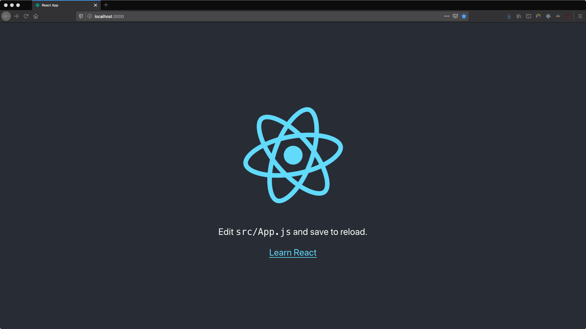
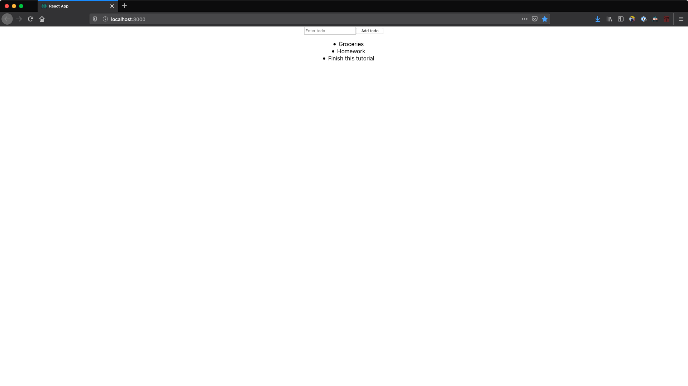

Too many awful coding tutorials exist. When I started learning React, it took me about a week alone before I could grasp even the most *basic* concepts. Hopefully I'll help anyone out there aspiring to learn React start up as quickly as possible! In this tutorial, we will be making a todo list app to learn the basics of React!

# Get Started - Create React App

For the purposes of this tutorial, we're going to make a simple application off of Create React App, which is a nice barebones application the people at React give to us. Information on Create React App can be found [here](https://reactjs.org/docs/create-a-new-react-app.html).

First thing's first, we need to get our dev environment setup. The first thing we need is `npm`, a stupid simple package manager that we'll use lots. npm comes with Node, so install Node [here](https://nodejs.org/en/). 

Once we have npm, open up a terminal and run

```
npm -v
```

just to make sure we have npm installed. Sweet, step one down! Next we need `npx` (a fancy npm) to setup our React project. Get npx by running this:

```
npm install -g npx
```

Sweet, now we have npx! Now is the easy part, actually creating the app. In your terminal, go to wherever you keep your projects (whether it be Documents, home, whatever), and type the following:

```
npx create-react-app my-app
```

where `my-app` is the name of your app. The script should take a few minutes to load... then once it's done, run your new React app by going:

```
cd my-app
npm start
```

again where `my-app` is the name of your app. Your terminal should open `localhost:3000` in your default browser (this is the address that your project will live in whenever you run `npm start`), and you should get the following screen:



# Making Our Own App

Cool, we got Create React App running, but this isn't much of an app. Let's see what this app is actually doing. Go ahead and open `src/App.js` from within the `my-app` directory. It'll look like this:

``` javascript
import React from 'react';
import logo from './logo.svg';
import './App.css';

function App() {
  return (
    <div className="App">
      <header className="App-header">
        
        <p>
          Edit <code>src/App.js</code> and save to reload.
        </p>
        <a
          className="App-link"
          href="https://reactjs.org"
          target="_blank"
          rel="noopener noreferrer"
        >
          Learn React
        </a>
      </header>
    </div>
  );
}

export default App;

```

Forget all that - go ahead and swap it with this code instead:

``` javascript
import React from 'react';
import './App.css';

class App extends React.Component {
  render() {
    return (
      <div className="App">
        <p>Hello World!</p>
      </div>
    );
  }
}

export default App;
```

What does this code do exactly? Well, the meat and potatoes of a React App are called **components**. Each component has a **name** (in this case, *App*) and a **render function** (what the component is supposed to render to the screen). The render function can return HTML as HTML, you don't even need to make it a string! The ability to do this is due to **JSX**, which is a syntax extension for Javascript that allows us to do this.

If you're curious, what brings our App component to life is the line in `index.js` that says

``` javascript
ReactDOM.render(<App />, document.getElementById('root'));
```

This renders the App component to the element with the id `root`.

Anyways, let's get to making our app, which will be a simple todo list.

## Setting up the State

One of the most important parts about React is the **state**. The state is the special sauce of React, it allows us to dynamically update the HTML based off our variables! Similar frameworks such as Angular and Vue have their own ways of maintaining variable value to the HTML, but the way React does it is my favorite. To get started with the state, add this function to the App class:

``` javascript
  constructor() {
    super()
    this.state = {
      listItems: [],
      todoInput: ""
    }
  }
```

The constructor is what sets up the state. You can put as many variables as you want in `this.state`, as this will get reflected to our app's state. In this case, we will use the state to keep track of our items in our todo list, and the todo we want to add to the list.

So, lets make an input where we can put in a todo. Replace your render function with this:

``` javascript
  render() {
    return (
      <div className="App">
        <input placeholder="Enter todo" value={this.state.todoInput} onChange={(event) => this.updateTodoInput(event)} />
      </div>
    );
  }
```

So instead of rendering Hello World!, we're rendering an input that is synchronized with `this.state.todoInput`. Then, add this function to the App class:

``` javascript
  updateTodoInput(event) {
    this.setState({
      todoInput: event.target.value
    });
  }
```

In the input, the `onChange` function calls `updateTodoInput` whenever the input field is changed (ie whenever the user presses a character on their keyboard that causes the text to change). `updateTodoInput` then takes this keyboard press and converts it into the string that is in the input field. We do this by calling `event.target.value` from the given event.

`this.setState()` is what we use to update the state outside of the constructor function (in the constructor function only we say `this.state = {...}`). We set the `todoInput` variable in the state to what's inside of the input field. After we update the state, if you look back up to the render function you'll see the input has the tag `value={this.state.todoInput}`. This means that what's in the input is what's in the state, so the two are now completely synchronized.

## Adding Todos

Awesome, we made a text box that does nothing. Now, let's make a button that adds a todo with what we type in the box! Once again, replace your render function with this:

``` javascript
  render() {
    return (
      <div className="App">
        <input placeholder="Enter todo" value={this.state.todoInput} onChange={(event) => this.updateTodoInput(event)} />
        <button onClick={() => this.addTodo()}>Add todo</button>
      </div>
    );
  }
```

Notice how we added a button with an `onClick` action - this says that when we click on the button, we run the function `addTodo` (just like `onChange`)! Since that function doesn't exist yet, let's make it now! Add this function to the App class:

``` javascript
  addTodo() {
    let newListItems = this.state.listItems;
    newListItems.push(this.state.todoInput);
    
    this.setState({
      listItems: newListItems,
      todoInput: ""
    });
  }
```

Let's break down this function - first, we make the updated listItems array, which contains the old listItems array with the new todo at the end of it. We do this because we can't just add an item to the state directly, we can only use `this.setState()` to modify the state. Once we have `newListItems`, we override listItems to newListItems, and reset the input field to blank.

If you run `npm start` and open `localhost:3000` you'll notice how we have a place to enter todos, and the button to add todos. But, when you click the button to add todo, nothing happens! To change this, we need to actually display the todos on the screen! Do this by replacing the render function with the following:

``` javascript
  render() {
    return (
      <div className="App">
        <input placeholder="Enter todo" value={this.state.todoInput} onChange={(event) => this.updateTodoInput(event)} />
        <button onClick={() => this.addTodo()}>Add todo</button>

        <ul>
          {this.state.listItems.map(todo => <li>{todo}</li>)}
        </ul>
      </div>
    );
  }
```

This creates an unordered list (ul) with a list item (li) for each of the todos in `this.state.listItems`. This is done via the **map** function, which transforms all items in an array or object into a different item (it's like a simpler for loop). In this case, we are taking each todo in `this.state.listItems` and transforming it into a list item for that todo (which is what `<li>{todo}</li>`). Note the curly braces - whenever we want to access code within embedded HTML we need these curly braces!

## Deleting Completed Todos

What if we want to delete todos from the list once we've added them? For this we'll say that if you click a todo, it'll get removed from the list. Well, we just need to add another function and an `onClick` handler to each todo! We do this by first replacing render with the following:

``` javascript
  render() {
    return (
      <div className="App">
        <input placeholder="Enter todo" value={this.state.todoInput} onChange={(event) => this.updateTodoInput(event)} />
        <button onClick={() => this.addTodo()}>Add todo</button>

        <ul>
          {this.state.listItems.map(todo => <li onClick={() => this.removeTodo(todo)}>{todo}</li>)}
        </ul>
      </div>
    );
  }
```

Notice how we pass `todo` into `this.removeTodo` - this is important as we need to tell the `removeTodo` function which todo to remove. Next, add the `removeTodo` function to the App component:

``` javascript
  removeTodo(removedTodo) {
    this.setState({
      listItems: this.state.listItems.filter(todo => todo !== removedTodo)
    });
  }
```

Breaking this function down: the `listItems` value in the state gets updated to `listItems` with the clicked todo not in it. To get the list without the clicked todo in it, we use the **filter** function, which returns an array or object where each element matches a specific condition. In this case, the condition is if each element isn't the todo we clicked on. This value gets updated back to the state, which removes the todo we clicked on from the state.

## Completed Todo App

Yeah, I know people scroll to the bottom to copy all the code (I'd recommend you read the above though to understand what it does!), so here it is:

App.js
``` javascript
import React from 'react';
import './App.css';

class App extends React.Component {
  constructor() {
    super()
    this.state = {
      listItems: [],
      todoInput: ""
    }
  }

  addTodo() {
    let newListItems = this.state.listItems;
    newListItems.push(this.state.todoInput);

    this.setState({
      listItems: newListItems,
      todoInput: ""
    });
  }

  removeTodo(removedTodo) {
    this.setState({
      listItems: this.state.listItems.filter(todo => todo !== removedTodo)
    });
  }

  updateTodoInput(event) {
    this.setState({
      todoInput: event.target.value
    });
  }

  render() {
    return (
      <div className="App">
        <input placeholder="Enter todo" value={this.state.todoInput} onChange={(event) => this.updateTodoInput(event)} />
        <button onClick={() => this.addTodo()}>Add todo</button>

        <ul>
          {this.state.listItems.map(todo => <li onClick={() => this.removeTodo(todo)}>{todo}</li>)}
        </ul>
      </div>
    );
  }
}

export default App;
```

Here's what the final app looks like when you run it:



There you have it, a tutorial on how to create a React App from scratch! I hope you found this tutorial helpful, if you have any further questions please don't hesitate to contact me at jaredlgrimes@hotmail.com.

Jared